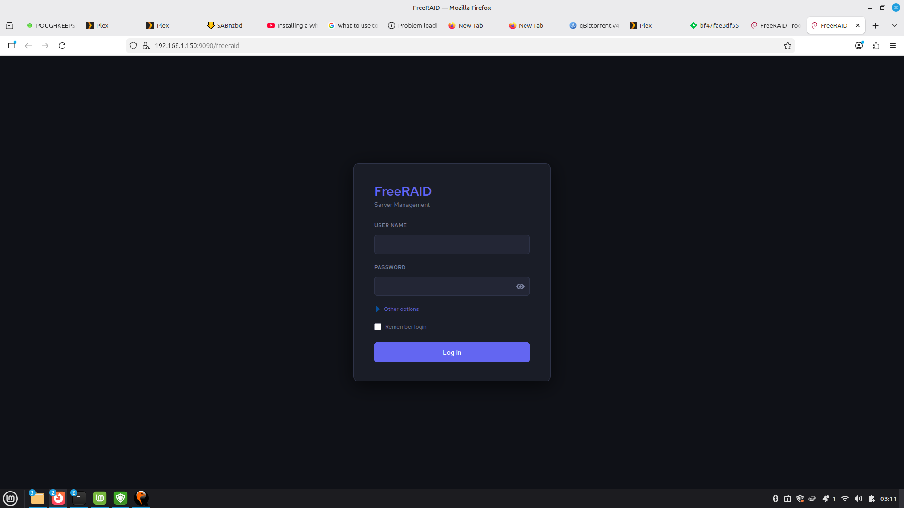
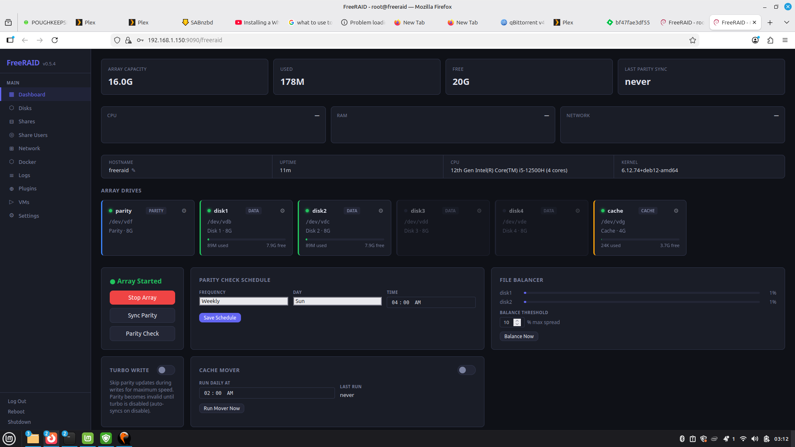
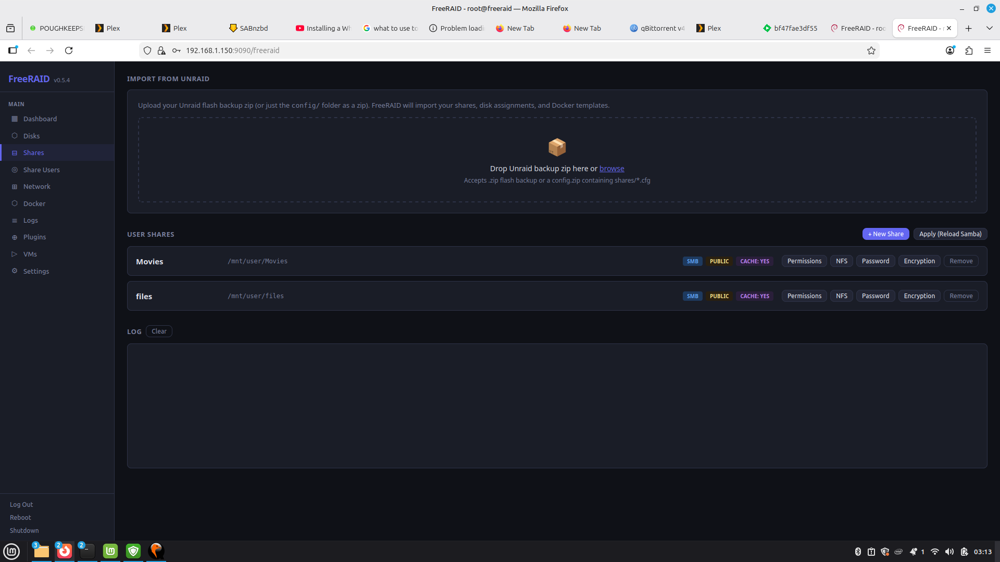
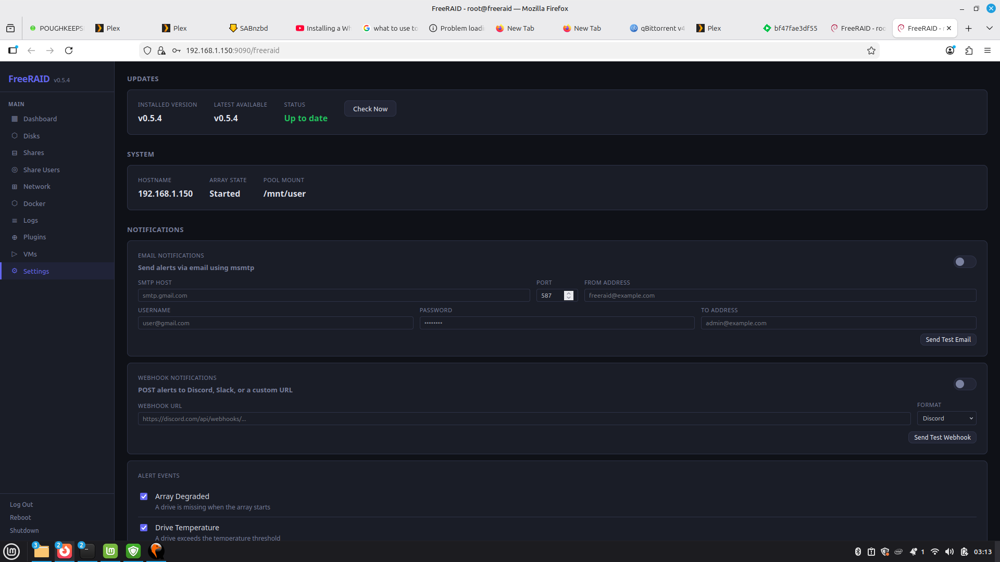

# FreeRAID

A free, open-source NAS operating system that boots from a USB drive. No installation to internal disk required — plug it in, power on, and manage your array from a web browser.

Inspired by Unraid. Built on Debian 12 + Cockpit + SnapRAID + mergerfs.

> ⚠️ **Beta — bear with us.** FreeRAID is in active development. Things work, but edges are still being sanded down. Expect rough corners, file issues, and check back often. Your feedback shapes the roadmap.

**→ Downloads, installer, and screenshots:** [getfreeraid.com](https://getfreeraid.com)

---

## Install

The fastest path is the GUI installer — it downloads the latest image, writes the USB, and optionally imports your existing Unraid config:

**[Download the installer at getfreeraid.com](https://getfreeraid.com/download/)**

> 🧪 **The GUI installer is still under testing.** If you hit a snag, [open an issue](https://github.com/crucifix86/FreeRAID/issues) and include the log output.

```bash
sudo ./freeraid-installer
```

Linux x86-64, no dependencies required. Pick a USB drive, drop in an optional Unraid flash-backup zip, click Write USB.

---

## Screenshots

| | |
|---|---|
|  |  |
| **Themed login page** | **Dashboard — array status, parity schedule, cache mover** |
|  |  |
| **Shares — SMB/NFS per-share, Unraid config drop-in import** | **Settings — updates, notifications, alerts** |

---

## Features

- **Boots from USB** — OS lives on the USB stick alongside your persistent config
- **Web UI** — full management interface via browser (no monitor needed)
- **SnapRAID + mergerfs** — scheduled parity protection (up to 6 parity disks) and unified storage pool
- **Docker** — install and manage containers through the UI
- **Samba + NFS** — network shares for Windows, Mac, and Linux
- **Unraid import** — migrate existing Unraid configs, shares, and docker containers
- **Safe test boot** — skip-parity mode leaves your Unraid parity untouched so you can swap USBs freely
- **UEFI + BIOS** — boots on modern and legacy hardware

---

## Requirements

- x86-64 PC or server
- 4 GB+ RAM
- USB drive (8 GB+) for the boot drive
- One or more storage drives for your array

---

## First Boot

1. Plug the USB into your server and power on
2. Open a browser and go to `https://<server-ip>:9090`
3. Log in with `root` / `freeraid`
4. Follow the setup wizard to assign drives and start the array

Config is saved to the USB drive — your settings survive reboots. Array data lives on your storage drives.

---

## Updating

From the FreeRAID web UI, go to Settings and click **Check for Updates**. Updates apply in-place without touching your array data or config.

---

## Building from source

Most users should grab the installer from [getfreeraid.com](https://getfreeraid.com/download/). Building is only needed if you're hacking on FreeRAID itself.

```bash
# Debian/Ubuntu host
sudo apt-get install -y debootstrap squashfs-tools busybox-static \
    grub-efi-amd64-bin syslinux dosfstools parted

# Live image (~15-20 min)
sudo bash scripts/build-image.sh

# GUI installer binary
sudo apt install -y python3-tk python3-pip
pip install --user pyinstaller
bash scripts/build-installer.sh        # → dist/freeraid-installer
```

---

## Project Structure

```
core/           freeraid CLI (main management script)
web/            Cockpit web UI plugin
scripts/        build-image.sh, build-installer.sh, create-usb.sh, installer.py
importer/       Unraid config importer
compose/        Default Docker compose templates
docs/           Architecture and development notes
```

---

## Feedback

Bugs, feature requests, and rough edges: [open an issue](https://github.com/crucifix86/FreeRAID/issues).

---

## License

FreeRAID is free for personal and non-commercial use. See [LICENSE](LICENSE) for details.
